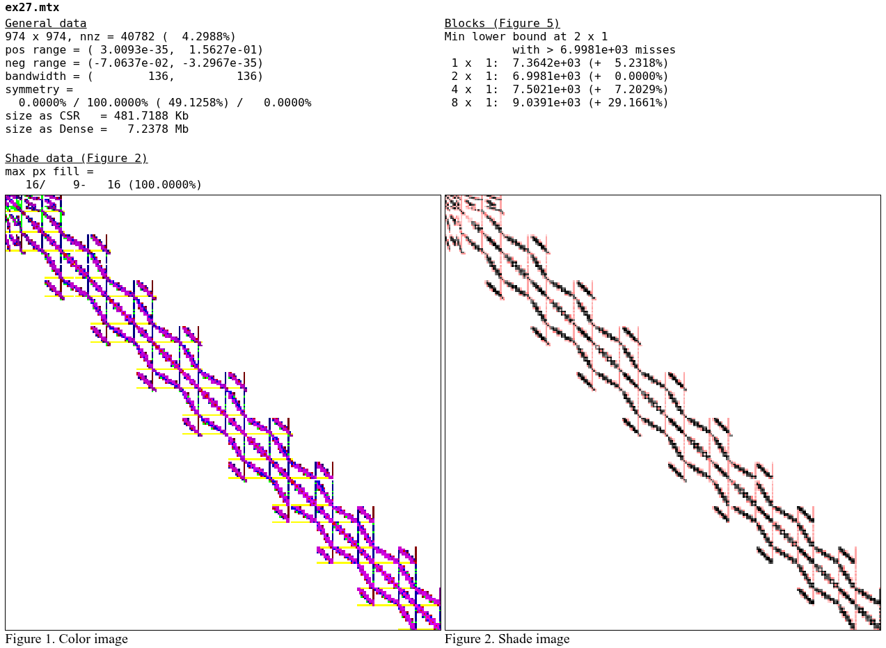
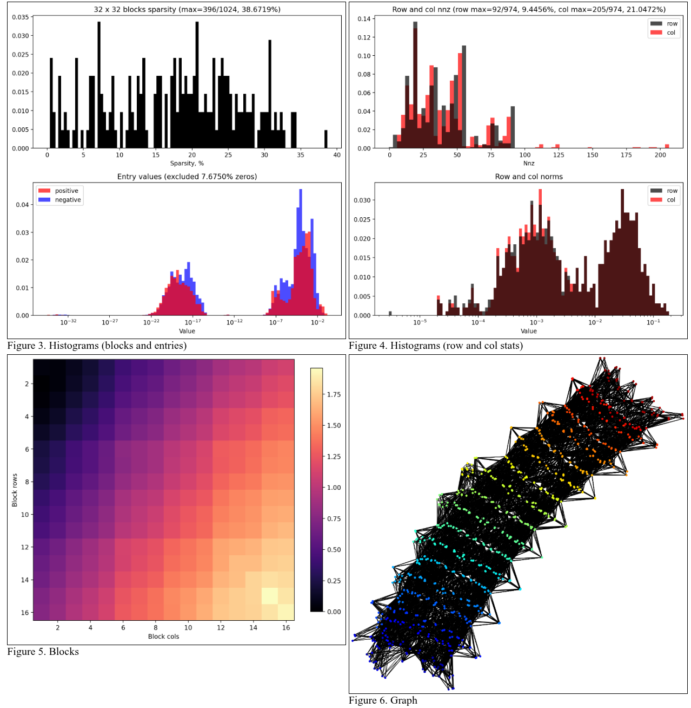

# MatrixReport

A python script for automatic creation of html reports on various properties of
sparse matrices. The script can also be imported and used as a module for more
complex reports. Reports are rendered as html which looks like this:

<div>
  
  
</div>

[ex27-report.pdf](./readme-figures/ex27-report.pdf) is an example of the html
rendered to pdf.

## Features

The following features are currently supported:
- Display of basic info: dimension, sparsity, bandwidth, symmetry, etc.
- Visual displays of matrix nonzero structure
- Plot of singular values and the spectrum
- Approximation of the condition number for large matrices
- Bounds on cache misses for different blocking storage schemes based on [R. Vuduc, et al., "Performance Optimizations and Bounds for Sparse Matrix-Vector Multiply," 2002](https://doi.org/10.1109/SC.2002.10025).
- Histograms for different statistics: block nonzeros, values, row nonzeros and norms
- Graph display of a matrix with [networkx](https://networkx.org) layouts
- Plot of Frobenius norm of an error during sparsification
- PDF-friendly formatting of the html output ([ex27-report.pdf](./readme-figures/ex27-report.pdf) is rendered simply with print-to-pdf)
- High customizability of all the plots
- Parallel processing of matrices
- Lazy-loading of matrices to avoid overwhelming the RAM
- Speedup of heavy computations with [numba](https://numba.pydata.org)

The following features are planned:
- Saving the report data in JSON
- Simple API to generate matrices out of existing ones (transformations)
- FFT of the matrix to check for a better representation
- Different standard permutations and transformations

Full docs are located at [DOCS.md](./DOCS.md).

## Usage

`matrix_report.py` can be used as a cli application in the following way:
```sh
python3 matrix_report.py [MATRIX_FOLDER] [OUTPUT_FOLDER]
```
This will read all matrix files from `MATRIX_FOLDER`, process them and write an
html report and its images to `OUTPUT_FOLDER`. To see the report open
`OUTPUT_FOLDER/index.html` in your browser.

For an example run you can use the command
```sh
python3 matrix_report.py matrices out
```

